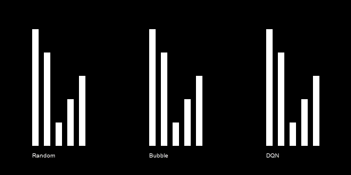

# DQNsort

Sorting 5 element arrays using Deep Q learning

# Setup and Run
    
	# Install dependencies
	pip install -r requirements.txt
	
	# Train
	visdom # Run visdom server in separate terminal
	python main.py train
	
	# or without visdom
	python main.py train --use_visdom False
	
	# Test
	python main.py test
	python main.py compare # Test comparing bubble, random, dqn